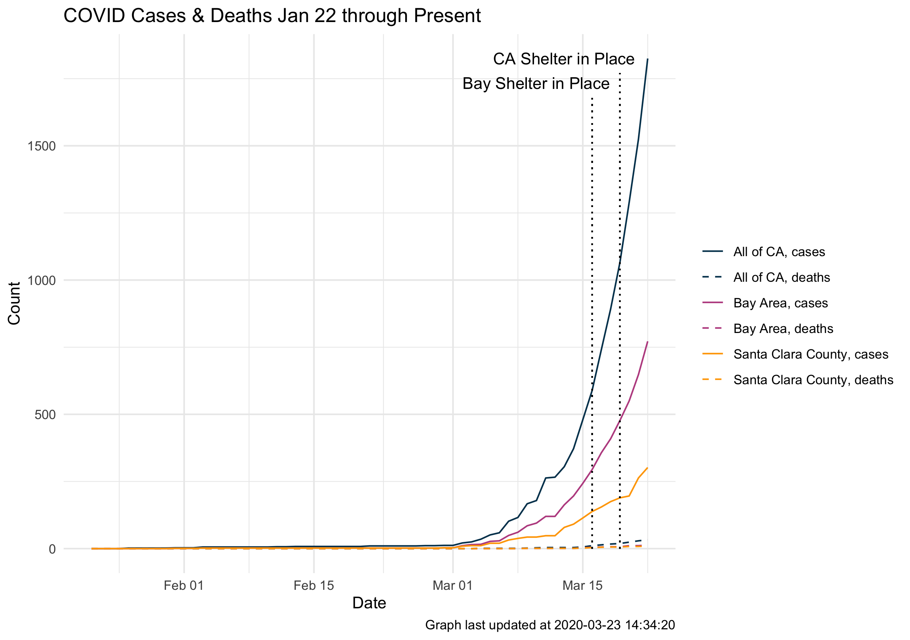

# COVID-19

**agg.py** pulls and aggregates the most recent COVID-19 data on conformed cases, deaths, and testing for the state of California, the nine counties that make up the Bay Area, and Santa Clara County.

Confirmed case and death data aggregated from county level data available from [USA Facts](https://usafacts.org/visualizations/coronavirus-covid-19-spread-map/).

State level testing rate data pulled from [The COVID Tracking Project](https://covidtracking.com/).

If you know of a reliable county-level report of testing data, please reach out or submit a pull request.

# Plot of cases and deaths

